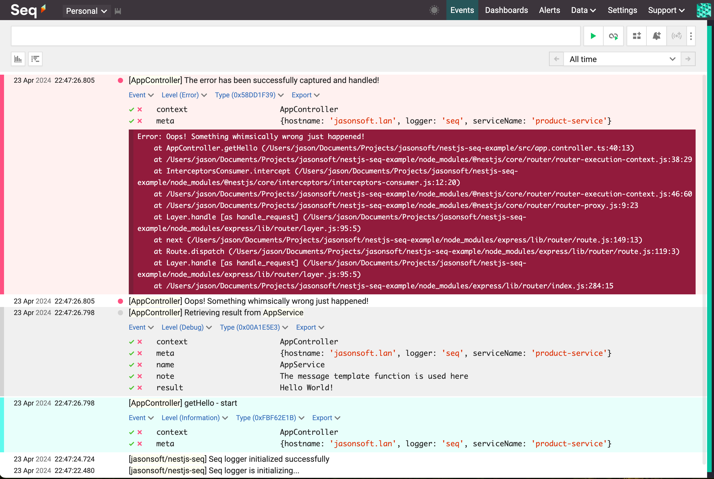
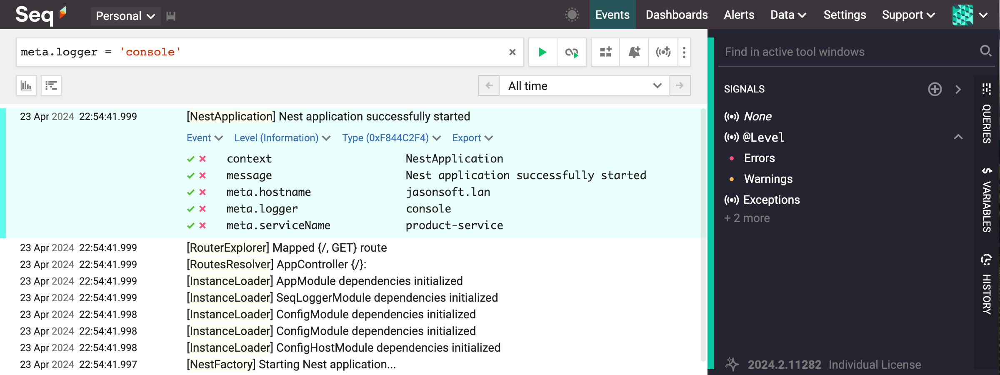

<p align="center">
  <a href="https://github.com/jasonsoft/" target="blank"></a>
  <a href="http://nestjs.com/" target="blank"></a>
  <a href="https://datalust.co/" target="blank"></a>
</p>

# 🍐 Example for @jasonsoft/nestjs-seq

Seq logging module for Nest framework (node.js)

[![NPM version][npm-img]][npm-url]
[![NPM Downloads][downloads-image]][npm-url]
[![GitHub stars][stars-img]][github-url]
[![License][license-img]][license-url]

## Installation

```bash
# Using npm
$ npm i --save @jasonsoft/nestjs-seq

# Using yarn
$ yarn add @jasonsoft/nestjs-seq

# Using pnpm
$ pnpm add @jasonsoft/nestjs-seq
```

## Quick Start

> After successfully installing the package, proceed to integrate the SeqLoggerModule into your project's root AppModule.

### Static Configuration

```js
import { Module } from '@nestjs/common';
import { AppController } from './app.controller';
import { AppService } from './app.service';
/**
 * Import the SeqLoggerModule into the root AppModule to enable centralized logging.
 * This module is configured to connect to a Seq server for log aggregation and analysis.
 * It is essential for monitoring and debugging applications by collecting and storing logs.
 * Updated by Jason.Song (成长的小猪) on 2024/04/21
 * Added by Jason.Song (成长的小猪) on 2021/09/08
 */
import { SeqLoggerModule } from '@jasonsoft/nestjs-seq';

@Module({
  imports: [
    /**
     * Import and configure the SeqLoggerModule using the .forRoot() method.
     * This method initializes the module with server-specific configurations,
     * allowing for centralized management of log data across the application.
     * Updated by Jason.Song (成长的小猪) on 2024/04/21
     * Added by Jason.Song (成长的小猪) on 2021/09/08
     */
    SeqLoggerModule.forRoot({
      /** Specifies the URL of the Seq server to which logs should be sent. */
      serverUrl: 'http://localhost:5341',
      /** Provides the API Key required for authenticating with the Seq server. */
      apiKey: 'K7iUhZ9OSp6oX5EOCfPt',
      /** Optional additional metadata properties */
      extendMetaProperties: {
        /** Defines a custom service name for the logs, aiding in their categorization and filtering.
         * This name helps in identifying logs related to this service in a mixed-service environment.
         */
        serviceName: 'product-service',
      },
      /** For more configuration details, see the "Seq Logger Options Documentation" section below. */
    }),
  ],
  controllers: [AppController],
  providers: [AppService],
})
export class AppModule {}
```

### Async Configuration

```js
// Import ConfigModule to manage application configuration through environment variables.
import { ConfigModule, ConfigService } from '@nestjs/config';
import { SeqLoggerModule } from '@jasonsoft/nestjs-seq';

@Module({
  imports: [
    ConfigModule.forRoot(),
    /**
     * Asynchronously configure the SeqLoggerModule using the forRootAsync() method.
     * This method allows module options to be passed asynchronously, leveraging factory providers
     * that can be asynchronous and inject dependencies such as ConfigService.
     * Updated by Jason.Song (成长的小猪) on 2024/04/21
     * Added by Jason.Song (成长的小猪) on 2021/10/20
     */
    SeqLoggerModule.forRootAsync({
      imports: [ConfigModule],
      useFactory: async (configService: ConfigService) => ({
        /** Specifies the HTTP/S endpoint address of the Seq server for log transmission. */
        serverUrl: configService.get('SEQ_SERVER_URL'),
        /** Provides the API Key required for authenticating with the Seq server. */
        apiKey: configService.get('SEQ_API_KEY'),
        /** Optional additional metadata properties to enhance log categorization and filtering. */
        extendMetaProperties: {
          /** Custom service name for the logs to assist in their categorization and filtering within a multi-service environment. */
          serviceName: configService.get('SEQ_SERVICE_NAME'),
        },
        /** For more configuration details, see the "Seq Logger Options Documentation" section below. */
      }),
      inject: [ConfigService],
    }),
  ],
  controllers: [AppController],
  providers: [AppService],
})
export class AppModule {}
```

### ✨ Seq Logger Options Documentation

Please refer to the [Seq Logger Options Documentation](SEQ_LOGGER_OPTIONS.md) for detailed explanations of the configuration options available for the Seq Logger. For immediate access to the document, click [here](SEQ_LOGGER_OPTIONS.md).

## Usage

```js
import { Controller, Get } from '@nestjs/common';
import { AppService } from './app.service';
/**
 * Import the SeqLogger for structured logging.
 * This logger allows for easy tracking and querying of log data.
 * Updated by Jason.Song (成长的小猪) on 2024/04/21
 * Added by Jason.Song (成长的小猪) on 2021/09/08
 */
import { SeqLogger } from '@jasonsoft/nestjs-seq';

@Controller()
export class AppController {
  constructor(
    /**
     * Inject the Seq Logger service for structured logging.
     * This service provides methods to log various levels of information (info, debug, error).
     * Updated by Jason.Song (成长的小猪) on 2024/04/21
     * Added by Jason.Song (成长的小猪) on 2021/09/08
     */
    private readonly logger: SeqLogger,
    private readonly appService: AppService,
  ) {}

  @Get()
  getHello(): string {
    this.logger.info('getHello - start', AppController.name);

    const result = this.appService.getHello();
    this.logger.debug(
      `Retrieving result from {name}`,
      {
        name: 'AppService',
        result,
        note: 'The message template function is used here',
      },
      AppController.name,
    );

    try {
      throw new Error('Oops! Something whimsically wrong just happened!');
    } catch (error: any) {
      this.logger.error(error, AppController.name);
      this.logger.error(
        'The error has been successfully captured and handled!',
        error,
        AppController.name,
      );

      return result;
    }
  }
}

```

### Seq

> Seq is a powerful centralized logging system. Explore the logs we have gathered:



## Nest System Console Logging to Seq

> This section describes how to integrate Nest system console logging with Seq through a custom console logger. To set up this integration, follow the steps below:

```typescript
import { NestFactory } from '@nestjs/core';
import { AppModule } from './app.module';
/**
 * Import the ConsoleSeqLogger to extend the built-in logger for supporting Seq.
 * Added by Jason.Song (成长的小猪) on 2021/09/24
 */
import { ConsoleSeqLogger } from '@jasonsoft/nestjs-seq';

async function bootstrap() {
  /**
   * Set bufferLogs to true to buffer all logs until the ConsoleSeqLogger is attached.
   * This ensures that logs are captured during the application initialization.
   * If initialization fails, Nest will use the default ConsoleLogger to output error messages.
   */
  const app = await NestFactory.create(AppModule, {
    bufferLogs: true,
  });

  /**
   * Use the ConsoleSeqLogger to extend the built-in logger functionality.
   */
  app.useLogger(app.get(ConsoleSeqLogger));

  await app.listen(3000);
}
bootstrap();
```

This setup allows your NestJS application to log directly to Seq, providing a centralized logging solution.

> Seq Interface Overview showing the integration of Nest System Console Logging with Seq.



[npm-img]: https://img.shields.io/npm/v/@jasonsoft/nestjs-seq.svg?style=flat-square
[npm-url]: https://npmjs.org/package/@jasonsoft/nestjs-seq
[license-img]: https://img.shields.io/badge/license-MIT-green.svg?style=flat-square
[license-url]: LICENSE
[downloads-image]: https://img.shields.io/npm/dt/@jasonsoft/nestjs-seq.svg?style=flat-square
[project-icon]: https://avatars.githubusercontent.com/u/22167571?v=4
[stars-img]: https://img.shields.io/github/stars/jasonsoft/nestjs-seq?style=social
[github-url]: https://github.com/jasonsoft/nestjs-seq
